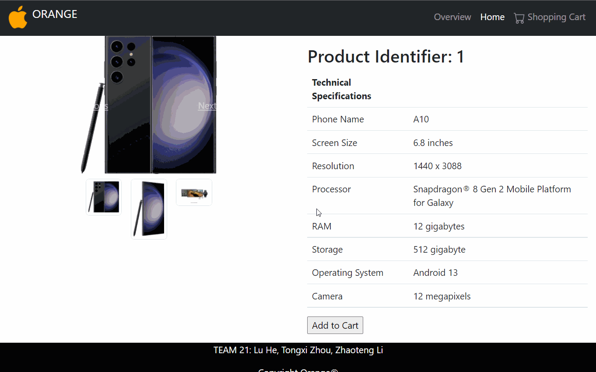

# TEAM 21
## Members: Lu He, Tongxi Zhou, Zhaoteng Li

## How to set up environment:
1) Use the DATA.sql file located on the home page of this repository to set up the database environment. 
2) Open the ConnectDatabase.java file, which is located in java\com\myservlet, and update your database information, such as name and password, on lines 19-22. 
3) Run the Build Task, and then add deployment and start the server.

## Tutorial/Overview of the Orange Website:
Our team has developed an e-commerce website called 'Orange' that sells three series of phones (A series, B series, and C series). At the top of the website, there is a navigation bar that contains three options:
* **Overview(overview.html)**: It contains all the information about the Orange company, such as its mission, the products it sells, and the management team.
* **Home(index.jsp)**: The home page displays the phones that the Orange company sells, and customers can view detailed information and order a specific product by clicking on the corresponding image of that product. This would automatically redirect them to the description page(*). The bottom contains the last five products'information that they placed, and the user will be able to give a rate to each product.
* **Shopping cart(Shopping_Cart.jsp)**: It displays all the products in the shopping cart, and user can place an order by filling out the form and clicking on the submit button. Once button clicks, it would direct to the order detail page
* **The description page(detailed_page.jsp)** displays detailed information about the product, and they user can add this product into the shopping cart.
* **order detail page(Order_Detail.jsp)**: it would display your last order's information

## Where the requirement satisify:
1. Use JSP to reimplement the home page (the page that contains the list of your products) for your website. Additionally, select two Java Servlets and reimplement them using JSP. Servlets that are mostly Java logic and do not produce a lot of HTML code can stay as Servlets, while those that produce a lot of HTML code with minimal Java logic are good candidates for turning into JSP.

The home page no longer relies on the servlet in any Java files, and all the logic is located in the index.jsp. Apart from that, the order detail page (Order_Detail.jsp) and the description page (detailed_page.jsp) have also been re-implemented.

2. Use Ajax to make your website dynamic and interactive. Among others, you could use Ajax to assist the user with filling the order forms, e.g., when the user chooses a particular state for delivery, obtain the corresponding tax rate from the backend database to update the total price for the product dynamically, or as another example, provide autocomplete capability, such as suggesting states as the user types the name of a state. You can use these files to help with this task: zip_codes.csv Download zip_codes.csvand tax_rates2.csv Download tax_rates2.csv. You have the freedom in identifying other opportunities for using Ajax in making your website dynamic and interactive. At the very least, your website should make use of Ajax for two non-trivial features that the grader can verify.

We use ajax in Shopping_Cart.jsp file. 
1) When the user enters zipcode, it would obtain the corresponding tax rate from the backend database to display and update the tax and total price for the product dynamically.
2) When the user enters a zip code, the system would obtain the city and state information from the backend database and automatically fill out the customer's form.

## Video Walkthrough

Here's a walkthrough of A4 for reference:

GIF created with [LiceCap](http://www.cockos.com/licecap/).
